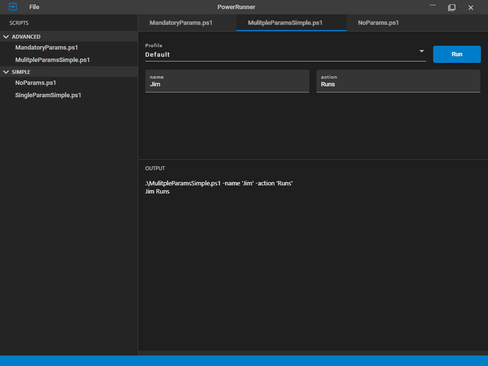

# PowerRunner

PowerShell Script runnner that loads scripts from paths and parses commmand line parameters to present a tabbed form and output window.

<br />

``` PowerShell
param (
    [string]$name = 'Jim',
    [string]$action = 'Runs'
)

Write-Host "$name $action"
```

<br>

